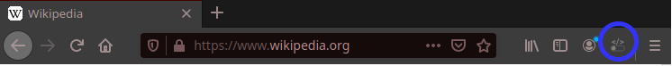
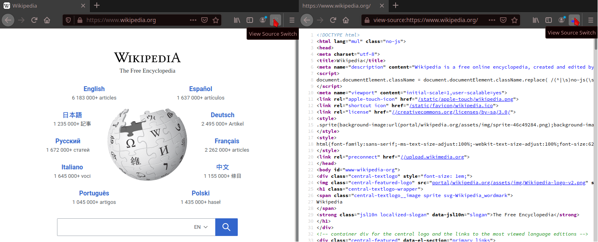
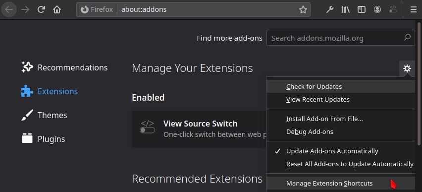

<h1>View Source Switch</h1>
View Source Switch is a Firefox add-on that allows one click switching the active tab between "view source" and regular web page.  

<h2>How does it work ?</h2>
Once the add-on is installed, a new icon appears in Firefox toolbar:  


Click on it to switch to the view-source of your active tab. Click again to switch back to the regular view:  


Instead of clicking, you can switch page with a keyboard shortcut. The default one is <strong>Ctrl + Alt + U</strong> / <strong>command + option + U</strong>.  
This key combination is intended to be similar to the Firefox built-in shortcut to view source in a new tab.  
However, this key combination can easily be changed in the Firefox <a href="about:addons">add-on menu</a>:  



<h3>What permissions are needed ?</h3>
The only needed permission is:  
<strong>Access browser tabs</strong>  
Per <a href="https://support.mozilla.org/en-US/kb/permission-request-messages-firefox-extensions#w_access-browser-tabs">Mozilla documentation</a>, 
this permission means that "The extension could obtain the URL, title, and icon from any tab". 
This permission is needed to maintain the View Source Switch icon up-to-date when changing active tab.

<h3>Does View Source Switch collect my data ?</h3>
No.  

<h2>Build from source</h2>  
Prerequisite:  
Install <a href="https://nodejs.dev/learn/how-to-install-nodejs">Node.js and npm</a>.  

The add-on can be built by running the following command from its root directory:  
```
npm install  
npm run build  
```

<h2>Legal notice</h2>
Firefox is a registered trademark of the Mozilla Foundation.  
View Source Switch and its developer are not affiliated, sponsored nor endorsed by the Mozilla Foundation.  


<h2>Changelog</h2>
  
1.0.0 -> first version  
0.0.1 -> first commit  
