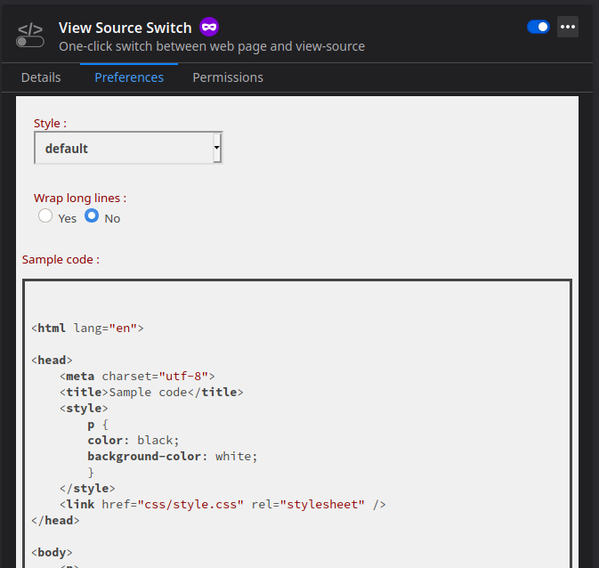

<h1>View Source Switch</h1>
View Source Switch is a Firefox add-on that allows one click switching the active tab between "view source" and regular web page.  

<h2>How does it work ?</h2>
Once the add-on is installed, a new icon appears in Firefox toolbar :  


Click on it to switch to the view-source of your active tab. Click again to switch back to the regular view :  


Instead of clicking, you can switch page with a keyboard shortcut. The default one is <strong>Ctrl + Shift + U</strong> / <strong>command + shift + U</strong>.  
This key combination is intended to be similar to the Firefox built-in shortcut to view source in a new tab.  
However, this key combination can easily be changed in the Firefox <a href="about:addons">add-on menu</a> :  


You can change the color scheme used for syntax highlight as well as the line wrapping in the extension preferences :


<h3>What permissions are needed ?</h3>
View Source Switch requires the following permission :

<strong>Access your data for all websites</strong>  

Per <a href="https://support.mozilla.org/en-US/kb/permission-request-messages-firefox-extensions#w_access-your-data-for-all-websites">Mozilla documentation</a>, 
"Access browser tabs" permission means that "The extension can read the content of any web page you 
visit as well as data you enter into those web pages, such as usernames and passwords".  
This permission is needed to get the source code of the page, apply highlighting on it, 
and then restitute this highlighted source code.

<h3>Does View Source Switch collect my data ?</h3>
No.  

<h3>Does View Source Switch send my data to anyone ?</h3>
No. 

<h2>Build from source</h2>  
Prerequisite :  
Install <a href="https://nodejs.dev/learn/how-to-install-nodejs">Node.js and npm</a>.  

Build :  
The add-on can be built by running the following command from its root directory :  
```
npm install  
npm run build  
```

Highlight.JS :  
Syntax highlighting and theming is made thanks to <a href="https://highlightjs.org/">Highlight.js</a> 
library. View Source Switch includes a custom build of the library for XML, Javascript and CSS.  
This can be done automatically on Unix / Linux system with `npm run build.highlight` command.  
On Windows, this should be done manually.  
Further information on building the library can be found here :  
https://highlightjs.readthedocs.io/en/latest/building-testing.html#building

<h2>Legal notice</h2>
Firefox is a registered trademark of the Mozilla Foundation.  
View Source Switch and its developer are not affiliated, sponsored nor endorsed by the Mozilla Foundation.  

<h2>Changelog</h2>  
2.0.0 -> new option to change highlight colors  
1.0.0 -> first version  
0.0.1 -> first commit  
